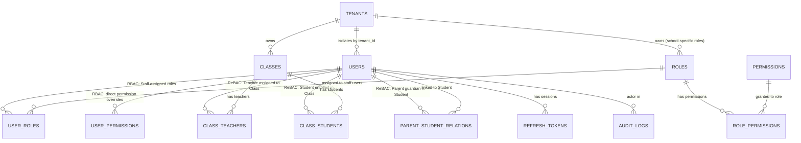

# School Management System — User & Access Architecture

> **Document Purpose**: Defines the complete User System architecture for a multi-tenant SaaS School Management platform. This is the **foundation layer** all future feature modules plug into. The first feature module launching on this foundation is the **Teacher Feedback System**.

---

## 1. System Philosophy & Build Strategy

Build **module by module**. The User System is built once, correctly. Every future module plugs in.

```
[ User System ]  ← Build This Now (This Document)
       |
       ├── [ Teacher Feedback Module ]  ← Launch Feature (MVP)
       ├── [ Attendance Module ]        ← Future (based on demand)
       ├── [ Exam & Results Module ]    ← Future
       ├── [ Fee Management Module ]    ← Future
       └── [ Communication Module ]    ← Future
```

> [!IMPORTANT]
> **Launch Strategy**: The SaaS will go live with only the Teacher Feedback Module. The User System must be designed to support future modules without requiring structural changes. New modules simply add their own permission slugs and use the existing user/relationship tables.

---

## 2. Multi-Tenant Architecture

The platform is fully **multi-tenant**. Each school is a completely isolated tenant.

- Every record in the system carries a `tenant_id`.
- A **Tenant Isolation Middleware** injects the `tenant_id` from the JWT into every database query automatically.
- **No user can ever access data from another tenant**, regardless of role.
- The only global user is the **Super Admin**, who has no `tenant_id`.

### Tenant Lifecycle

```
Super Admin Creates School Tenant
        ↓
School Admin account is provisioned (one per school)
        ↓
School Admin sets up their school:
  → Creates roles, assigns permissions to roles
  → Creates users (Teachers, Staff), assigns roles to them
  → Creates classes, assigns teachers, enrolls students
  → Links parents to students
        ↓
Feature Modules become active for that tenant
```

---

## 3. User Types & Portal Access

The system has **two distinct access paradigms**:

| Paradigm | Applies To | How Access Works |
|---|---|---|
| **Portal-Based Access** | Student, Parent | Access is determined purely by `user_type`. They each have their own separate portal/view. No roles or permissions are assigned. Data is scoped by their relationships (ReBAC). |
| **Dynamic Role-Based Access (RBAC)** | Teacher, Staff/Moderator | Access is determined by roles and permissions that the School Admin configures dynamically. |

### 3.1 User Types at a Glance

| User Type | Scope | Access Paradigm |
|---|---|---|
| **Super Admin** | System (Global) | Fixed — full system access, no tenant |
| **School Admin** | Tenant (School) | Fixed — full school access, no role needed |
| **Staff** (Teacher, Moderator, etc.) | Tenant (Scoped) | Dynamic RBAC — roles and permissions assigned by School Admin |
| **Parent / Guardian** | Tenant (Scoped) | Portal-based — sees only their linked children's data |
| **Student** | Tenant (Scoped) | Portal-based — sees only their own data |

---

## 4. User Type Details

### 4.1 Super Admin *(System Level)*

- Not tied to any school (`tenant_id = NULL`).
- Can create, configure, suspend, and delete school tenants.
- Can view system-wide analytics (total tenants, active users, usage).
- **Cannot** view any school's internal data (students, teachers, feedback, etc.).
- Authenticates via a separate, dedicated Super Admin portal.
- Only one or a very small team — managed outside the dynamic role system.

### 4.2 School Admin *(One per School)*

- Has **full, unrestricted access** to everything within their school. No role or permission assignment needed.
- Is the **sole manager** of the User System within their school:
  - Create, edit, and deactivate custom **roles** (e.g., "Class Teacher", "Head of Department", "Accountant").
  - Assign **permissions** to roles (e.g., `feedback:write`, `attendance:manage`).
  - Create **users** and assign roles to them.
  - Create **classes**, assign teachers to classes, enroll students in classes.
  - Link **parents to students**.
- Can view, edit, and manage all data across all modules in their school.

> [!NOTE]
> There is **one School Admin per school**. This account is created by the Super Admin when a new tenant is provisioned.

### 4.3 Staff Users — Teachers, Moderators, etc. *(Dynamic RBAC)*

- This is the group that uses the **dynamic RBAC system**.
- `user_type` is stored as `STAFF` in the database. The distinction between "Teacher", "Accountant", "Receptionist", etc. is handled entirely by the **roles** that the School Admin creates.
- A Staff user's access is determined by the role(s) assigned to them.
- Example role setup by a School Admin:

  | Role Name | Permissions |
  |---|---|
  | Class Teacher | `feedback:write`, `attendance:manage`, `classes:read` |
  | Subject Teacher | `feedback:write`, `classes:read` |
  | Finance Staff | `fees:read`, `fees:manage` |
  | Receptionist | `attendance:read`, `communication:read` |

- A user can be assigned **one or more roles**.
- Permissions are the **union** of all their assigned roles' permissions.
- School Admin can also grant or deny a **specific permission directly** to a user (override).

> [!TIP]
> This dynamic system eliminates "role explosion". The School Admin defines exactly what their staff structure looks like — the system doesn't impose a rigid structure.

### 4.4 Parent / Guardian *(Portal-Based — No RBAC)*

- Gets access to the **Parent Portal** based solely on `user_type = PARENT`.
- **No roles or permissions are assigned to Parents.**
- Data access is scoped entirely by the `parent_student_relations` table:
  - A Parent can only see data for students explicitly linked to them.
  - They can never see data for any other student, even within the same school.
- One Parent account can be linked to multiple children.
- For the Feedback Module: Can view all feedback reports written for their linked children.

### 4.5 Student *(Portal-Based — No RBAC)*

- Gets access to the **Student Portal** based solely on `user_type = STUDENT`.
- **No roles or permissions are assigned to Students.**
- Data access is scoped to their own records only:
  - Can see their own feedback (if enabled by School Admin).
  - Cannot see any other student's data.
  - For future modules: sees their own attendance, results, etc.

---

## 5. Access Control Model

### 5.1 Two Layers Working Together

```
Incoming API Request
        ↓
[ 1. Auth Guard ]
  → Is the JWT valid? Is the user ACTIVE?
        ↓
[ 2. Tenant Guard ]
  → Is this request scoped to the correct tenant_id from the JWT?
  → (Skipped for Super Admin)
        ↓
[ 3. Portal Route Guard ]
  → For Student/Parent routes: Is user_type correct? (e.g., only PARENT hits /parent/*)
  → For Staff routes: Does the user have the required permission slug via RBAC?
  → For School Admin routes: Is user_type SCHOOL_ADMIN?
        ↓
[ 4. ReBAC Data Scope ] ← Applied at the database query level
  → Teacher: Query only includes students from their assigned classes.
  → Parent: Query only includes data for their linked children.
  → Student: Query only includes their own records.
        ↓
[ Controller / Handler ]
```

### 5.2 RBAC Resolution for Staff

When a Staff user makes a request requiring a permission (e.g., `feedback:write`):

```
1. Get all role_ids assigned to the user (from user_roles table)
2. Get all permission slugs from role_permissions for those roles
3. Get any direct user_permissions overrides for this user
4. Effective permissions = Union(role permissions) + Granted overrides - Denied overrides
5. Check if required permission slug is in effective permissions
```

### 5.3 ReBAC Data Scoping (Applied in Queries)

```sql
-- Teacher: Only see students in their classes
WHERE student_id IN (
  SELECT cs.student_id FROM class_students cs
  JOIN class_teachers ct ON cs.class_id = ct.class_id
  WHERE ct.teacher_id = :currentUserId
)

-- Parent: Only see their linked children's data
WHERE student_id IN (
  SELECT student_id FROM parent_student_relations
  WHERE parent_id = :currentUserId
)

-- Student: Only their own data
WHERE student_id = :currentUserId
```

---

## 6. Database Schema

### 6.1 Core Tenant & User Tables

```sql
tenants (
  id             UUID PRIMARY KEY,
  name           VARCHAR(255) NOT NULL,
  domain         VARCHAR(255) UNIQUE,            -- Optional subdomain
  status         ENUM('ACTIVE', 'SUSPENDED', 'TRIAL') DEFAULT 'TRIAL',
  created_at     TIMESTAMP DEFAULT NOW(),
  updated_at     TIMESTAMP DEFAULT NOW()
)

users (
  id             UUID PRIMARY KEY,
  tenant_id      UUID REFERENCES tenants(id),    -- NULL for Super Admin
  email          VARCHAR(255) UNIQUE NOT NULL,
  password_hash  VARCHAR(255) NOT NULL,
  first_name     VARCHAR(100) NOT NULL,
  last_name      VARCHAR(100) NOT NULL,
  phone          VARCHAR(20),
  avatar_url     VARCHAR(500),
  user_type      ENUM('SUPER_ADMIN', 'SCHOOL_ADMIN', 'STAFF', 'PARENT', 'STUDENT') NOT NULL,
  status         ENUM('ACTIVE', 'INACTIVE', 'SUSPENDED') DEFAULT 'ACTIVE',
  created_by     UUID REFERENCES users(id),
  created_at     TIMESTAMP DEFAULT NOW(),
  updated_at     TIMESTAMP DEFAULT NOW()
)
```

> [!NOTE]
> `user_type` is now simplified to 5 types. Teachers, Moderators, Receptionists — all are `STAFF`. Their specific role is determined by the dynamic role system, not the `user_type` column.

### 6.2 Dynamic RBAC Tables *(For STAFF users only)*

```sql
-- Roles created dynamically by School Admin (e.g., "Class Teacher", "Finance Staff")
roles (
  id             UUID PRIMARY KEY,
  tenant_id      UUID REFERENCES tenants(id) NOT NULL,  -- Roles are per-school
  name           VARCHAR(100) NOT NULL,
  description    TEXT,
  created_by     UUID REFERENCES users(id),
  created_at     TIMESTAMP DEFAULT NOW(),
  UNIQUE (tenant_id, name)
)

-- All possible permission actions in the system
-- Seeded by the system, not created by School Admin
permissions (
  id             UUID PRIMARY KEY,
  module         VARCHAR(100) NOT NULL,           -- e.g., 'feedback', 'attendance'
  action         VARCHAR(100) NOT NULL,           -- e.g., 'read', 'write', 'manage'
  slug           VARCHAR(200) UNIQUE NOT NULL,    -- e.g., 'feedback:write'
  description    TEXT,
  is_active      BOOLEAN DEFAULT TRUE             -- Can disable future module perms until unlocked
)

-- Maps permissions to roles (School Admin configures this)
role_permissions (
  role_id        UUID REFERENCES roles(id) ON DELETE CASCADE,
  permission_id  UUID REFERENCES permissions(id),
  PRIMARY KEY (role_id, permission_id)
)

-- Assigns roles to staff users (School Admin configures this)
user_roles (
  user_id        UUID REFERENCES users(id) ON DELETE CASCADE,
  role_id        UUID REFERENCES roles(id) ON DELETE CASCADE,
  assigned_by    UUID REFERENCES users(id),
  assigned_at    TIMESTAMP DEFAULT NOW(),
  PRIMARY KEY (user_id, role_id)
)

-- Direct per-user permission overrides (grant or deny specific permissions)
user_permissions (
  id             UUID PRIMARY KEY,
  user_id        UUID REFERENCES users(id) ON DELETE CASCADE,
  permission_id  UUID REFERENCES permissions(id),
  granted        BOOLEAN DEFAULT TRUE,            -- TRUE = extra grant, FALSE = explicit deny
  granted_by     UUID REFERENCES users(id),
  created_at     TIMESTAMP DEFAULT NOW(),
  UNIQUE (user_id, permission_id)
)
```

### 6.3 ReBAC Relationship Tables

```sql
-- Classes within a school
classes (
  id             UUID PRIMARY KEY,
  tenant_id      UUID REFERENCES tenants(id) NOT NULL,
  name           VARCHAR(100) NOT NULL,           -- e.g., 'Grade 5A', 'Class 10 Science'
  academic_year  VARCHAR(20),                     -- e.g., '2025-2026'
  created_by     UUID REFERENCES users(id),
  created_at     TIMESTAMP DEFAULT NOW()
)

-- "Teacher is ASSIGNED_TO Class (for Subject)"
class_teachers (
  class_id       UUID REFERENCES classes(id) ON DELETE CASCADE,
  teacher_id     UUID REFERENCES users(id) ON DELETE CASCADE,
  subject        VARCHAR(100),                    -- e.g., 'Mathematics'
  assigned_by    UUID REFERENCES users(id),
  assigned_at    TIMESTAMP DEFAULT NOW(),
  PRIMARY KEY (class_id, teacher_id, subject)
)

-- "Student BELONGS_TO Class"
class_students (
  class_id       UUID REFERENCES classes(id) ON DELETE CASCADE,
  student_id     UUID REFERENCES users(id) ON DELETE CASCADE,
  enrolled_at    TIMESTAMP DEFAULT NOW(),
  PRIMARY KEY (class_id, student_id)
)

-- "Parent is GUARDIAN_OF Student"
parent_student_relations (
  id                  UUID PRIMARY KEY,
  parent_id           UUID REFERENCES users(id) ON DELETE CASCADE,
  student_id          UUID REFERENCES users(id) ON DELETE CASCADE,
  relationship_type   ENUM('FATHER', 'MOTHER', 'GUARDIAN') NOT NULL,
  is_primary_contact  BOOLEAN DEFAULT FALSE,
  linked_by           UUID REFERENCES users(id),
  linked_at           TIMESTAMP DEFAULT NOW(),
  UNIQUE (parent_id, student_id)
)
```

### 6.4 Auth & Audit Tables

```sql
-- JWT refresh token store
refresh_tokens (
  id             UUID PRIMARY KEY,
  user_id        UUID REFERENCES users(id) ON DELETE CASCADE,
  token_hash     VARCHAR(255) UNIQUE NOT NULL,
  expires_at     TIMESTAMP NOT NULL,
  is_revoked     BOOLEAN DEFAULT FALSE,
  ip_address     VARCHAR(50),
  user_agent     TEXT,
  created_at     TIMESTAMP DEFAULT NOW()
)

-- Audit trail for sensitive actions
audit_logs (
  id             UUID PRIMARY KEY,
  tenant_id      UUID REFERENCES tenants(id),
  actor_id       UUID REFERENCES users(id),
  action         VARCHAR(200) NOT NULL,           -- e.g., 'user.created', 'role.assigned'
  target_type    VARCHAR(100),                    -- e.g., 'user', 'role', 'class'
  target_id      UUID,
  metadata       JSONB,
  created_at     TIMESTAMP DEFAULT NOW()
)
```

---

## 7. Entity Relationship Diagram



---

## 8. Authentication Flow

### 8.1 Token Strategy

| Token | Lifetime | Storage | Purpose |
|---|---|---|---|
| **Access Token** (JWT) | 15 minutes | Authorization Header (Bearer) | Authenticate every API request |
| **Refresh Token** | 7–30 days | HttpOnly Cookie | Generate new access tokens |

### 8.2 JWT Payload

```json
{
  "sub": "user-uuid",
  "tenant_id": "tenant-uuid",
  "user_type": "STAFF",
  "email": "teacher@school.com",
  "iat": 1717000000,
  "exp": 1717000900
}
```

> [!NOTE]
> Roles and permissions are **not embedded** in the JWT. They are resolved fresh from the DB on protected requests (with caching). This ensures permission changes take effect immediately without requiring token re-issue.

### 8.3 Login Flow

```
POST /auth/login { email, password }
        ↓
Validate credentials → Check user status (ACTIVE only)
        ↓
Identify user_type → Load relevant portal context
        ↓
Issue: Access Token (JWT, 15min) + Refresh Token (hashed in DB)
        ↓
Response: { access_token, user_type } in body
Set-Cookie: refresh_token (HttpOnly, Secure, SameSite=Strict)
```

---

## 9. API Endpoints — User System

### Authentication (Public / Any Authenticated User)
| Method | Endpoint | Access | Description |
|---|---|---|---|
| `POST` | `/auth/login` | Public | Login for all user types |
| `POST` | `/auth/refresh` | Cookie | Rotate refresh token, get new access token |
| `POST` | `/auth/logout` | Authenticated | Revoke current refresh token |
| `GET` | `/auth/me` | Authenticated | Get own profile + user_type |
| `PATCH` | `/auth/me/password` | Authenticated | Change own password |

### Tenant Management (Super Admin Only)
| Method | Endpoint | Description |
|---|---|---|
| `GET` | `/admin/tenants` | List all schools |
| `POST` | `/admin/tenants` | Create a new school (and provisions School Admin) |
| `PATCH` | `/admin/tenants/:id` | Update school details |
| `PATCH` | `/admin/tenants/:id/status` | Suspend or reactivate a school |

### Role Management (School Admin Only)
| Method | Endpoint | Description |
|---|---|---|
| `GET` | `/roles` | List all roles in the school |
| `POST` | `/roles` | Create a new role (e.g., "Class Teacher") |
| `PATCH` | `/roles/:id` | Update role name/description |
| `DELETE` | `/roles/:id` | Delete a role |
| `GET` | `/roles/:id/permissions` | List permissions assigned to a role |
| `PUT` | `/roles/:id/permissions` | Set the full permission list for a role |

### Permission Reference (School Admin Only)
| Method | Endpoint | Description |
|---|---|---|
| `GET` | `/permissions` | List all available permissions in the system |

### User Management (School Admin Only)
| Method | Endpoint | Description |
|---|---|---|
| `GET` | `/users` | List all users in the school (filterable by user_type) |
| `POST` | `/users` | Create a user (any user_type) |
| `GET` | `/users/:id` | Get user details |
| `PATCH` | `/users/:id` | Update user profile |
| `PATCH` | `/users/:id/status` | Activate or suspend a user |
| `DELETE` | `/users/:id` | Soft-delete a user |
| `GET` | `/users/:id/roles` | Get roles assigned to a staff user |
| `PUT` | `/users/:id/roles` | Set roles for a staff user |
| `GET` | `/users/:id/permissions` | Get effective permissions + overrides for a staff user |
| `PATCH` | `/users/:id/permissions/:slug` | Grant or deny a specific permission directly |

### Class & Relationship Management (School Admin Only)
| Method | Endpoint | Description |
|---|---|---|
| `GET` | `/classes` | List classes in the school |
| `POST` | `/classes` | Create a class |
| `PATCH` | `/classes/:id` | Update class details |
| `POST` | `/classes/:id/teachers` | Assign a teacher to a class (with subject) |
| `DELETE` | `/classes/:id/teachers/:teacherId` | Remove a teacher from a class |
| `POST` | `/classes/:id/students` | Enroll a student in a class |
| `DELETE` | `/classes/:id/students/:studentId` | Remove a student from a class |
| `POST` | `/relations/parent-student` | Link a parent to a student |
| `DELETE` | `/relations/parent-student/:id` | Remove a parent-student link |
| `GET` | `/students/:id/parents` | Get all parents linked to a student |
| `GET` | `/parents/:id/students` | Get all students linked to a parent |

---

## 10. Permission Slugs Reference

Permissions are **seeded by the system**. New modules add their own slugs when introduced. School Admin assigns existing slugs to their custom roles.

### User System (Core — Always Active)
| Slug | Who Needs It | Description |
|---|---|---|
| `users:read` | Any staff who views user lists | View users in the school |
| `users:write` | — | Restricted to School Admin (not assignable) |
| `classes:read` | Teachers, some staff | View class info and rosters |
| `classes:manage` | — | Restricted to School Admin (not assignable) |

### Feedback Module *(MVP Launch Permissions)*
| Slug | Who Needs It | Description |
|---|---|---|
| `feedback:write` | Teachers | Create and submit feedback reports for students |
| `feedback:read` | Any staff who monitors | View feedback reports across the school |
| `feedback:manage` | Senior staff | Edit and delete any feedback report |

> [!NOTE]
> Parent and Student access to feedback **does not use permission slugs**. Their access is governed purely by their `user_type` and their ReBAC relationships.

### Future Module Permissions *(Inactive Until Module Is Added)*
| Slug | Module |
|---|---|
| `attendance:read` | Attendance |
| `attendance:manage` | Attendance |
| `exams:read` | Exams & Results |
| `exams:manage` | Exams & Results |
| `fees:read` | Fee Management |
| `fees:manage` | Fee Management |
| `communication:read` | Announcements |
| `communication:write` | Announcements |

---

## 11. Implementation Roadmap

### ✅ Phase 0: User System *(Build Now)*

- [ ] **Database**: Create all tables from Section 6.
- [ ] **Seed Data**: Populate `permissions` table with all slugs (including future ones, marked `is_active = false`).
- [ ] **Auth Module**: Login, logout, JWT, refresh token rotation, `GET /auth/me`.
- [ ] **Tenant Middleware**: Auto-inject and validate `tenant_id` on every request.
- [ ] **RBAC Guards**: Middleware to evaluate effective permissions for STAFF users.
- [ ] **Portal Route Guards**: Middleware to validate `user_type` for PARENT/STUDENT routes.
- [ ] **User Management API**: Full CRUD + role assignment by School Admin.
- [ ] **Role Management API**: Dynamic role create/edit/delete + permission assignment.
- [ ] **Class & Relation Management API**: Classes, teacher assignments, student enrollment, parent-student links.
- [ ] **Super Admin Tenant API**: Create and manage school tenants.

---

### 🚧 Phase 1: Teacher Feedback Module *(MVP — Launch Feature)*

Built entirely on top of the Phase 0 user system. No schema changes to the User System needed.

**Data Flow:**
```
Teacher (STAFF with feedback:write) submits feedback for a student
        ↓
Stored as: { tenant_id, teacher_id, student_id, class_id, content, ... }
        ↓
Parent logs in → Hits /parent/feedback
Backend: SELECT * FROM feedback WHERE student_id IN (
  SELECT student_id FROM parent_student_relations WHERE parent_id = :me
) AND tenant_id = :tenantId
        ↓
Parent sees feedback for their children only.
```

**RBAC guard** verifies the Teacher has `feedback:write`.
**ReBAC check** verifies the student is in one of the Teacher's assigned classes before allowing submission.

---

### 📅 Phase 2+: Future Modules *(Add on Demand)*

Each module is self-contained. To add one:
1. Create the module's database tables (scoped to `tenant_id`).
2. Activate the module's permission slugs (`is_active = true`).
3. School Admins can now assign those permissions to roles.

| Phase | Module | What It Needs from User System |
|---|---|---|
| 2 | Attendance | `class_students`, `class_teachers`, STAFF with `attendance:*` |
| 3 | Exams & Results | `class_students`, `class_teachers`, STAFF with `exams:*` |
| 4 | Fee Management | `users`, `tenants`, STAFF with `fees:*` |
| 5 | Communication | `users`, role-based targeting, STAFF with `communication:*` |

---

## 12. Security Checklist

- [ ] Passwords hashed with **bcrypt** (min 12 rounds).
- [ ] JWT signed with **RS256** (asymmetric) — never HS256.
- [ ] Refresh tokens stored as **bcrypt-hashed values** — never raw.
- [ ] All queries enforce `tenant_id` from JWT — **never trust client-provided tenant IDs**.
- [ ] Rate limiting on `/auth/login` (e.g., 5 attempts / minute per IP + email).
- [ ] Refresh tokens **rotated** on every use (old one revoked immediately).
- [ ] User `status` is checked on **every** token validation — suspended users are blocked instantly.
- [ ] All sensitive actions (role changes, user creation, permission grants) logged to `audit_logs`.

---

*Last Updated: 2026-06-07*
*Status: Phase 0 — User System (Pending Implementation)*
*MVP Launch Module: Teacher Feedback System*
